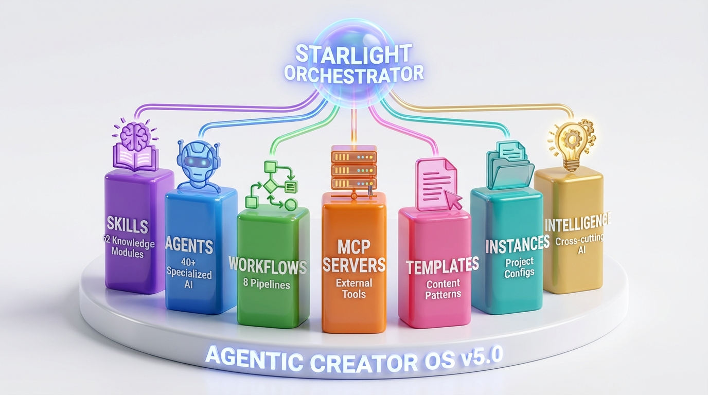
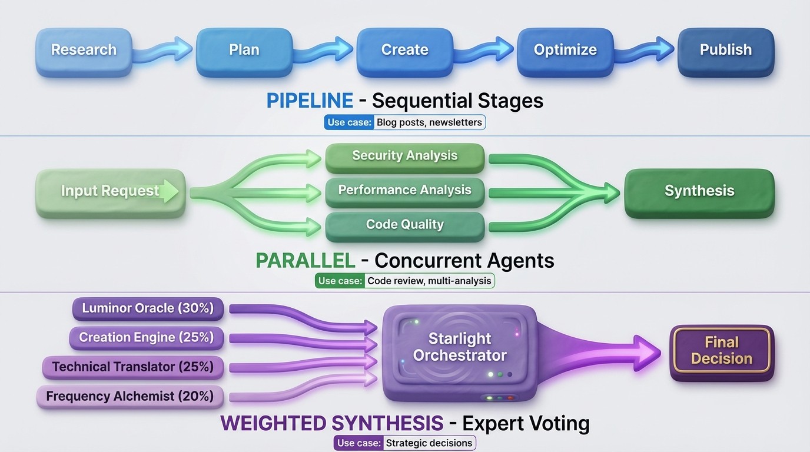
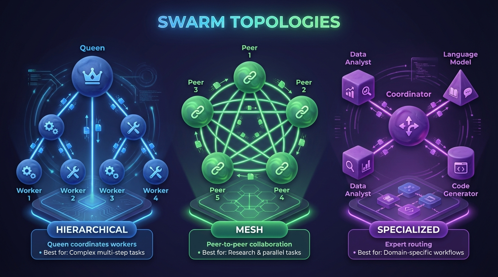
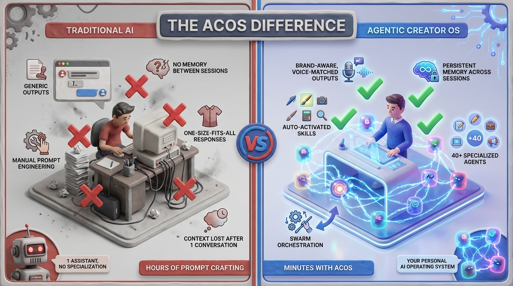

# Agentic Creator OS
**The Operating System for Golden Age Creators**

[]()
[]()
[]()
[]()

---

## What Is Agentic Creator OS?

Agentic Creator OS is a **superintelligent operating system for generative creators** - a complete intelligence layer that transforms how you work with AI. Built on Claude Code, it combines 62 specialized skills, 9 intelligent agents, orchestrated workflows, and MCP integrations into one cohesive system.

> **Philosophy**: Technology that amplifies creative expression, not replaces it.



### The 7 Pillars

| Pillar | Count | Purpose |
|--------|-------|---------|
| **Skills** | 62 | Domain knowledge modules with progressive disclosure |
| **Agents** | 40+ | Specialized AI personas for specific domains |
| **Workflows** | 8 | Orchestrated pipelines for complex operations |
| **MCP Servers** | 4+ | External tool integrations |
| **Templates** | 20+ | Reusable content patterns |
| **Instances** | ∞ | Project-specific configurations |
| **Intelligence** | 1 | Starlight Orchestrator meta-coordinator |

---

## Quick Start

### For Users

```bash
# View system status
cat agentic-creator-os/PRO_STATUS_DASHBOARD.md

# See all available skills
cat agentic-creator-os/SKILL_TREE.md

# Check architecture
cat agentic-creator-os/ARCHITECTURE.md
```

### For Developers

```bash
# Clone and setup
git clone <repo>
cd agentic-creator-os
./install.sh

# Build MCP servers
./build-servers.sh
```

---

## System Components

### 1. Skills Layer (62 Skills)

Skills are specialized knowledge modules that enhance Claude's capabilities in specific domains.

| Category | Count | Examples |
|----------|-------|----------|
| **Technical** | 18 | TDD, systematic-debugging, mcp-architecture, react-nextjs-patterns |
| **Creative** | 8 | frankx-brand, suno-ai-mastery, golden-age-book-writing |
| **Soulbook** | 25 | 7 pillars, life-symphony, golden-path |
| **Business** | 2 | oci-services-expert, product-management |
| **Personal** | 4 | spartan-warrior, gym-training-expert |
| **Projects** | 5 | daily-content-ops, frankx-daily-execution |

**Key Innovation**: Progressive Disclosure Architecture
```
Level 1: Metadata (~100 tokens) → "Is this relevant?"
Level 2: Instructions (<5k tokens) → "How do I do this?"
Level 3: Resources (on-demand) → "Give me the details"
```

### 2. Agents Layer (9 Agents)

Agents are specialized AI personas with distinct domains and weighted influence.

**Specialist Agents:**
| Agent | Domain | Weight |
|-------|--------|--------|
| Starlight Orchestrator | Meta-coordination | Coordinator |
| Luminor Oracle | Strategy, foresight | 30% |
| Creation Engine | Content, products | 25% |
| Technical Translator | AI education | 25% |
| Frequency Alchemist | Music, consciousness | 20% |

**Department Teams:**
- Content Department (Writer, Editor, Publisher)
- Design Department (Visual, UX, Brand)
- Dev Department (Frontend, Backend, DevOps)
- Marketing Department (Growth, Ads, Analytics)
- Business Department (Strategy, Sales, Ops)

### 3. Workflows Layer (8 Pipelines)

Orchestrated sequences that coordinate skills and agents for complex tasks.

| Workflow | Purpose | Pattern |
|----------|---------|---------|
| Content Creation | Blog posts, articles | Pipeline |
| Product Launch | Course/product release | Multi-stage |
| Research to Article | Deep research → publication | Pipeline |
| Social Distribution | Cross-platform posting | Parallel |
| Newsletter | Weekly digest creation | Pipeline |
| Code Review | Multi-agent code analysis | Parallel |
| Book Writing | Chapter development | Iterative |
| Daily Ops | Daily execution workflow | Scheduled |

### 4. MCP Servers Layer

External capabilities via Model Context Protocol.

| Server | Purpose |
|--------|---------|
| Browser (Playwright) | Web automation, testing |
| Creator (Social APIs) | Platform management |
| Database | Content storage |
| Email | Newsletter delivery |
| Memory | Knowledge persistence |
| Sequential Thinking | Complex reasoning |

---

## How It Works

### Skill Auto-Activation

Skills activate automatically based on context keywords:

```
User: "Help me write tests for this component"
      ↓
System detects: "tests", "component"
      ↓
Auto-loads: test-driven-development + react-nextjs-patterns
      ↓
Claude now has specialized testing knowledge
```

### Orchestration Patterns



| Pattern | Description | Best For |
|---------|-------------|----------|
| **Pipeline** | Sequential stages: Research → Plan → Create → Optimize → Publish | Blog posts, newsletters |
| **Parallel** | Concurrent agents with synthesis | Code review, multi-analysis |
| **Weighted Synthesis** | Expert voting with percentage weights | Strategic decisions |

---

## Directory Structure

```
agentic-creator-os/
├── README.md               ← YOU ARE HERE
├── CLAUDE.md               # AI context file
├── ARCHITECTURE.md         # 7-pillar system design
├── SKILL_TREE.md          # Visual skill map
├── PRO_STATUS_DASHBOARD.md # System health
├── AUDIENCE_PERSONAS.md    # Who we serve
├── ORCHESTRATION_PATTERNS.md # How it coordinates
│
├── skills/                 # Agentic Creator skills
│   └── content-strategy/   # Example comprehensive skill
│       ├── SKILL.md       # Core skill file (<500 lines)
│       └── resources/     # Extended content
│
├── templates/              # Creation templates
│   ├── SKILL_TEMPLATE.md  # Master skill template
│   ├── library/           # Content templates
│   └── social-media/      # Platform templates
│
├── departments/            # Agent teams
│   ├── content/           # Content creation team
│   ├── design/            # Visual/UX team
│   ├── dev/               # Development team
│   ├── marketing/         # Growth team
│   └── business/          # Strategy team
│
├── workflows/              # Orchestrated pipelines
│   ├── content-creation/  # Blog post pipeline
│   ├── product-launch/    # Launch sequence
│   └── daily-ops/         # Daily execution
│
├── instances/              # Project configurations
│   ├── frankx/            # FrankX configuration
│   └── _template/         # Template for new projects
│
├── mcp-servers/            # MCP integrations
│   ├── browser/           # Playwright automation
│   ├── creator/           # Social APIs
│   ├── database/          # Content storage
│   └── email/             # Email delivery
│
├── adapters/               # Platform adapters
│   └── opencode/          # OpenCode integration
│
├── scripts/                # Utility scripts
├── drafts/                 # Work in progress
└── outputs/                # Generated artifacts
```

---

## Usage Patterns

### Invoke a Skill

```bash
/skill content-strategy      # Load content planning skill
/skill test-driven-development  # Load TDD methodology
/skill frankx-brand          # Load brand guidelines
```

### Activate an Agent

```
"Activate Technical Translator mode for creator education"
"Channel Frequency Alchemist for music creation"
"Engage Creation Engine for content development"
```

### Run a Workflow

```
/daily-content-ops           # Run daily content workflow
/factory                     # Full publishing pipeline
/research                    # Deep research workflow
```

### Check System Status

```bash
cat agentic-creator-os/PRO_STATUS_DASHBOARD.md
```

---

## The 7 Pillars of Architecture

The system is built on 7 foundational pillars:

| # | Pillar | Purpose |
|---|--------|---------|
| 1 | **Skills** | Domain knowledge modules |
| 2 | **Agents** | Specialized AI personas |
| 3 | **Workflows** | Orchestrated processes |
| 4 | **MCP Servers** | External tool integrations |
| 5 | **Templates** | Reusable content patterns |
| 6 | **Instances** | Project configurations |
| 7 | **Intelligence** | Cross-cutting capabilities |

Each pillar is documented in detail in `ARCHITECTURE.md`.

---

## Who This Serves

### The AI-Curious Professional
**Need**: Quick wins with AI without the learning curve
**Solution**: Pre-built skills and workflows for immediate productivity

### The Overwhelmed Entrepreneur
**Need**: AI that amplifies authentic voice, not generic output
**Solution**: Brand-aware agents and content strategy frameworks

### The Enterprise Visionary
**Need**: Scalable AI architecture for teams
**Solution**: Orchestration patterns and department structures

See `AUDIENCE_PERSONAS.md` for detailed persona profiles.

---

## Creating New Skills

Use the master template to create new skills:

```bash
# Copy template
cp templates/SKILL_TEMPLATE.md skills/[category]/[skill-name]/SKILL.md

# Follow the structure:
# - YAML frontmatter with triggers
# - Purpose section
# - When to Use section
# - Core patterns with code examples
# - FrankX application
# - Anti-patterns
# - Related skills
```

### Success Criteria

- [ ] Total file under 500 lines
- [ ] YAML frontmatter with specific triggers
- [ ] Complete, working code examples (no placeholders)
- [ ] FrankX-specific application section
- [ ] Anti-patterns documented
- [ ] Related skills linked

See `templates/SKILL_TEMPLATE.md` for the full template.

---

## Metrics & Status

| Metric | Target | Current |
|--------|--------|---------|
| Total Skills | 70 | 62 (88%) |
| Auto-activation Rate | 90% | 70% |
| Agent Effectiveness | 95% | 94% |
| Workflow Completion | 95% | 92% |
| MCP Server Uptime | 99% | 100% |

See `PRO_STATUS_DASHBOARD.md` for real-time metrics.

---

## The FrankX Story

This system was built by Frank, a musician-turned-technologist who bridged the gap between:
- **Creative expression** and **technical systems**
- **Oracle enterprise AI** and **indie creator tools**
- **Consciousness evolution** and **practical productivity**

After producing 500+ AI songs with Suno, building enterprise AI systems at Oracle, and struggling with generic AI outputs, Frank created Agentic Creator OS to solve the fundamental problem:

> How do you use AI without losing your soul?

The answer: **Technology that amplifies your unique expression, guided by intelligent agents that understand your voice, orchestrated through workflows that maintain quality at scale.**

---

## License & Attribution

Agentic Creator OS is part of the FrankX ecosystem. We believe in giving credit where it's due.

**Core Inspirations:**
| Project | Author | What We Learned |
|---------|--------|-----------------|
| [claude-flow](https://github.com/ruvnet/claude-flow) | @ruvnet | Swarm orchestration, hierarchical topologies, consensus |
| [wshobson/agents](https://github.com/wshobson/agents) | @wshobson | Plugin architecture, 108-agent patterns, modular skills |
| [obra/superpowers](https://github.com/obra/superpowers) | @obra | Progressive disclosure, token-efficient skill loading |
| [awesome-claude-skills](https://github.com/travisvn/awesome-claude-skills) | @travisvn | Community skill conventions and discovery |
| [VoltAgent/awesome-claude-code-subagents](https://github.com/VoltAgent/awesome-claude-code-subagents) | VoltAgent | 100+ subagent patterns |

**Built on:**
- [Claude Code](https://claude.ai/claude-code) by Anthropic
- [Model Context Protocol (MCP)](https://modelcontextprotocol.io/) for tool integrations
- Community patterns from the growing Claude ecosystem

👉 **See [CREDITS.md](CREDITS.md) for full acknowledgments**

---

## Visual Documentation

Explore the system through our infographic gallery:

| Concept | Infographic |
|---------|-------------|
| **Swarm Topologies** |  |
| **ACOS vs Traditional AI** |  |

📁 **[View all 10 infographics →](docs/infographics/)**

---

## Quick Links

| Document | Purpose |
|----------|---------|
| [ARCHITECTURE.md](ARCHITECTURE.md) | Complete 7-pillar architecture |
| [SKILL_TREE.md](SKILL_TREE.md) | Visual map of all 62 skills |
| [PRO_STATUS_DASHBOARD.md](PRO_STATUS_DASHBOARD.md) | System health metrics |
| [AUDIENCE_PERSONAS.md](AUDIENCE_PERSONAS.md) | Who we serve |
| [ORCHESTRATION_PATTERNS.md](ORCHESTRATION_PATTERNS.md) | Coordination patterns |
| [SKILL_TEMPLATE.md](templates/SKILL_TEMPLATE.md) | Create new skills |
| [CREDITS.md](CREDITS.md) | Acknowledgments & inspirations |
| [Infographics](docs/infographics/) | Visual documentation gallery |

---

*Agentic Creator OS - The Operating System for the Golden Age Creator*

**Version 5.0.0** | **January 2026** | **70 Skills** | **10 Agents** | **8 Workflows**
