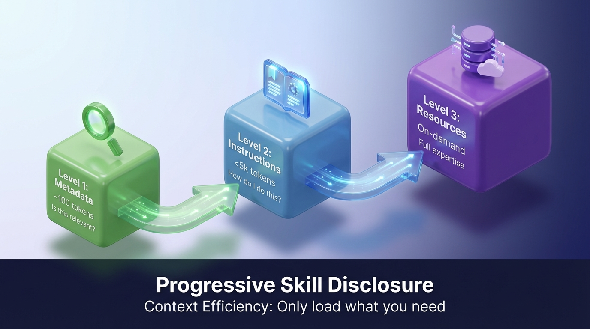
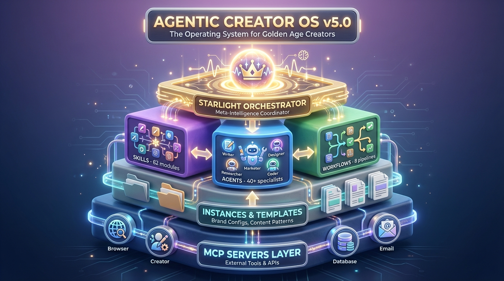
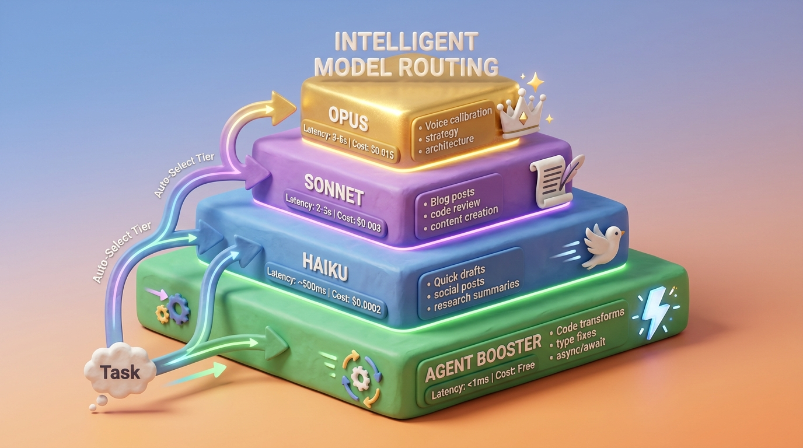
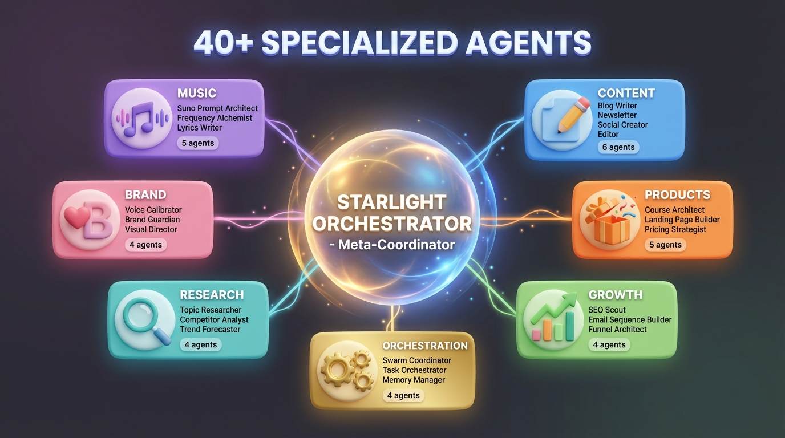
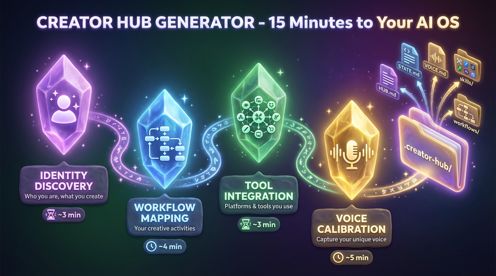
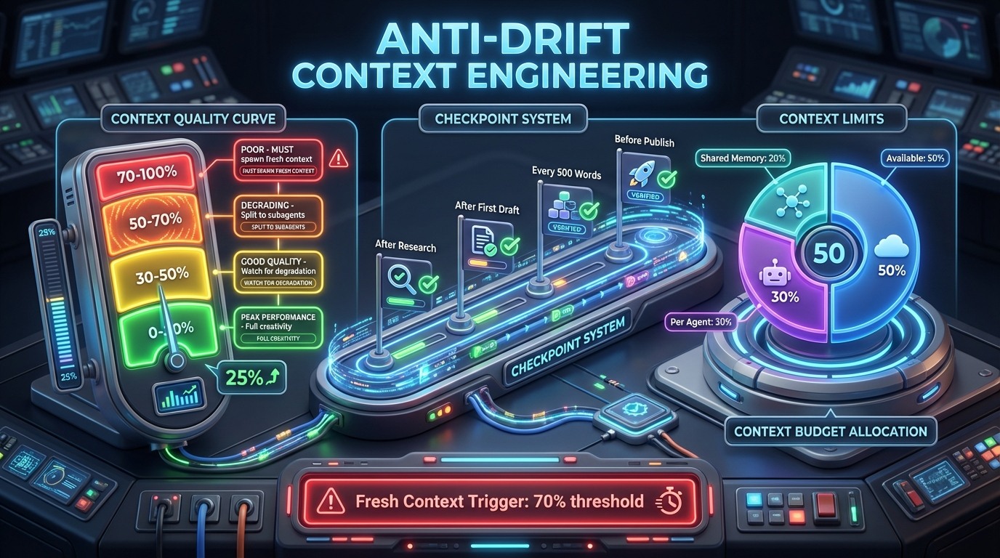

# Agentic Creator OS
**The Operating System for Generative Creators**


---

## What Is Agentic Creator OS?

A **production-grade operating system for generative creators** — built on Claude Code. One command (`/acos`) routes to 130+ commands, 630+ skills, and 40+ agents. Skills auto-activate. Hooks enforce quality. Everything composes.

> **v7.0**: Smart routing, auto-activating skills, lifecycle hooks, Agentic Jujutsu learning, Visionary strategic layer.

### System Architecture


### Agent Library


---

## Quick Start

### Option 1: Full Install (Recommended)

```bash
# Clone and install
git clone https://github.com/frankxai/agentic-creator-os.git
cd agentic-creator-os
./install.sh

# Open Claude Code and use
claude
/acos
```

### Option 2: Manual Setup

```bash
# Clone
git clone https://github.com/frankxai/agentic-creator-os.git
cd agentic-creator-os

# Copy commands to user level (required for /commands to work)
cp .claude/commands/*.md ~/.claude/commands/

# Open Claude Code
claude
/acos
```

### First Commands to Try

```bash
/acos                # Smart router — shows all 26 commands
/article-creator     # Write a blog post
/create-music        # Produce a track with Suno
/infogenius          # Generate research-grounded images
/spec                # Spec-driven feature development
/starlight-architect # Enterprise AI system design
```

> **See [QUICKSTART.md](QUICKSTART.md) for detailed setup instructions**

---

## System Components

### 1. Commands Layer (25 Commands)

v6 introduces `/acos` as the smart router — one entry point that detects your intent and dispatches to the right command.

| Category | Commands | Examples |
|----------|----------|----------|
| **Creation** | 8 | `/article-creator`, `/create-music`, `/infogenius`, `/factory` |
| **Strategy** | 5 | `/starlight-architect`, `/council`, `/research`, `/plan-week` |
| **Development** | 4 | `/spec`, `/nextjs-deploy`, `/ux-design`, `/automation-dev` |
| **System** | 5 | `/acos`, `/inventory-status`, `/mcp-status`, `/publish` |
| **Quality** | 3 | `/review-content`, `/classify-content`, `/polish-content` |

**Key Innovation**: Smart Routing
```
/acos → Parse intent → Route to best command
  "write a blog post"    → /article-creator
  "make a track"         → /create-music
  "build a feature"      → /spec
  "strategic decision"   → /starlight-architect
  (ambiguous)            → Interactive menu with all 25 commands
```

### 2. Skills Layer (80+ Skills)

Skills are specialized knowledge modules that auto-activate based on context — no manual invocation needed.

| Category | Count | Examples |
|----------|-------|----------|
| **Technical** | 18 | TDD, systematic-debugging, mcp-architecture, react-nextjs-patterns |
| **Creative** | 8 | frankx-brand, suno-ai-mastery, golden-age-book-writing |
| **Content** | 12 | content-strategy, social-media-strategy, excellence-book-writing |
| **Business** | 4 | oci-services-expert, product-management, coaching-program |
| **Personal** | 4 | spartan-warrior, gym-training-expert, health-nutrition |
| **System** | 5+ | cacos, agentic-orchestration, planning-with-files |

**Key Innovation**: Auto-Activation via `skill-rules.json`
```
User: "Help me write tests for this component"
      ↓
skill-rules.json detects: "tests" + "component"
      ↓
Auto-loads: test-driven-development + react-nextjs-patterns
      ↓
Claude now has specialized testing knowledge
```

### 3. Agents Layer (40+ Agents)

Agents are specialized AI personas with distinct domains and weighted influence.

**Specialist Agents:**
| Agent | Domain | Role |
|-------|--------|------|
| Starlight Orchestrator | Meta-coordination | Synthesizes specialist perspectives |
| Visionary | Strategy, foresight | Long-term planning & market analysis |
| Creation Engine | Content, products | Publishing & product development |
| Code Architect | Dev, systems | Technical architecture & implementation |
| Sonic Engineer | Music, audio | AI music production & audio design |

**Department Teams:**
- Content Department (Writer, Editor, Publisher)
- Design Department (Visual, UX, Brand)
- Dev Department (Frontend, Backend, DevOps)
- Marketing Department (Growth, Ads, Analytics)
- Business Department (Strategy, Sales, Ops)

### 3. Workflows Layer (8 Pipelines)

Orchestrated sequences that coordinate skills and agents for complex tasks.

| Workflow | Purpose | Pattern |
|----------|---------|---------|
| Content Creation | Blog posts, articles | Pipeline |
| Product Launch | Course/product release | Multi-stage |
| Research to Article | Deep research → publication | Pipeline |
| Social Distribution | Cross-platform posting | Parallel |
| Newsletter | Weekly digest creation | Pipeline |
| Code Review | Multi-agent code analysis | Parallel |
| Book Writing | Chapter development | Iterative |
| Daily Ops | Daily execution workflow | Scheduled |

### 4. MCP Servers Layer

External capabilities via Model Context Protocol.

| Server | Purpose |
|--------|---------|
| Browser (Playwright) | Web automation, testing |
| Creator (Social APIs) | Platform management |
| Database | Content storage |
| Email | Newsletter delivery |
| Memory | Knowledge persistence |
| Sequential Thinking | Complex reasoning |

---

## How It Works

### The `/acos` Front Door

Everything starts with `/acos`. It parses your intent and routes to the best subsystem:

```
/acos "write a blog post about AI agents"
  → Detects: creation + blog
  → Routes to: /article-creator
  → Auto-loads: content-strategy skill
  → Result: Guided article creation workflow
```

For multi-domain requests, it chains commands:
```
/acos "Create a blog post about AI music with images and social posts"
  → /research "AI music production"
  → /article-creator (with research context)
  → /infogenius (hero image)
  → /generate-social (distribution)
```

### Orchestration Patterns


| Pattern | Description | Best For |
|---------|-------------|----------|
| **Pipeline** | Sequential stages: Research → Plan → Create → Optimize → Publish | Blog posts, newsletters |
| **Parallel** | Concurrent agents with synthesis | Code review, multi-analysis |
| **Weighted Synthesis** | Expert voting with percentage weights | Strategic decisions |

---

## Directory Structure

```
agentic-creator-os/
├── README.md               ← YOU ARE HERE
├── CLAUDE.md               # AI context file
├── ARCHITECTURE.md         # 7-pillar system design
├── SKILL_TREE.md          # Visual skill map
├── PRO_STATUS_DASHBOARD.md # System health
├── AUDIENCE_PERSONAS.md    # Who we serve
├── ORCHESTRATION_PATTERNS.md # How it coordinates
│
├── skills/                 # Agentic Creator skills
│   └── content-strategy/   # Example comprehensive skill
│       ├── SKILL.md       # Core skill file (<500 lines)
│       └── resources/     # Extended content
│
├── templates/              # Creation templates
│   ├── SKILL_TEMPLATE.md  # Master skill template
│   ├── library/           # Content templates
│   └── social-media/      # Platform templates
│
├── departments/            # Agent teams
│   ├── content/           # Content creation team
│   ├── design/            # Visual/UX team
│   ├── dev/               # Development team
│   ├── marketing/         # Growth team
│   └── business/          # Strategy team
│
├── workflows/              # Orchestrated pipelines
│   ├── content-creation/  # Blog post pipeline
│   ├── product-launch/    # Launch sequence
│   └── daily-ops/         # Daily execution
│
├── instances/              # Project configurations
│   ├── frankx/            # FrankX configuration
│   └── _template/         # Template for new projects
│
├── mcp-servers/            # MCP integrations
│   ├── browser/           # Playwright automation
│   ├── creator/           # Social APIs
│   ├── database/          # Content storage
│   └── email/             # Email delivery
│
├── adapters/               # Platform adapters
│   └── opencode/          # OpenCode integration
│
├── scripts/                # Utility scripts
├── drafts/                 # Work in progress
└── outputs/                # Generated artifacts
```

---

## Usage Patterns

### The Easy Way (v6)

```bash
/acos                        # Interactive menu — pick anything
/acos "write about AI agents" # Smart routing — auto-dispatches
```

### Direct Commands

```bash
# Creation
/article-creator             # Write a blog post
/create-music                # Produce a music track
/infogenius                  # Generate research-grounded images
/factory                     # Full pipeline: research → publish

# Strategy
/starlight-architect         # Enterprise AI system design
/research                    # Daily intelligence scan
/plan-week                   # Weekly content planning

# Development
/spec                        # Spec-driven feature development
/nextjs-deploy               # Ship to production

# System
/inventory-status            # Content inventory dashboard
/publish                     # Deploy content with quality gates
```

### Magic Words

| Word | Effect |
|------|--------|
| `ultrawork` / `ulw` | Fire ALL relevant agents in parallel |
| `ultracode` / `ulc` | Fire coding specialists in parallel |

---

## The 7 Pillars of Architecture

The system is built on 7 foundational pillars:

| # | Pillar | Purpose |
|---|--------|---------|
| 1 | **Skills** | Domain knowledge modules |
| 2 | **Agents** | Specialized AI personas |
| 3 | **Workflows** | Orchestrated processes |
| 4 | **MCP Servers** | External tool integrations |
| 5 | **Templates** | Reusable content patterns |
| 6 | **Instances** | Project configurations |
| 7 | **Intelligence** | Cross-cutting capabilities |

Each pillar is documented in detail in `ARCHITECTURE.md`.

---

## Who This Serves

### The AI-Curious Professional
**Need**: Quick wins with AI without the learning curve
**Solution**: Pre-built skills and workflows for immediate productivity

### The Overwhelmed Entrepreneur
**Need**: AI that amplifies authentic voice, not generic output
**Solution**: Brand-aware agents and content strategy frameworks

### The Enterprise Visionary
**Need**: Scalable AI architecture for teams
**Solution**: Orchestration patterns and department structures

See `AUDIENCE_PERSONAS.md` for detailed persona profiles.

---

## Creating New Skills

Use the master template to create new skills:

```bash
# Copy template
cp templates/SKILL_TEMPLATE.md skills/[category]/[skill-name]/SKILL.md

# Follow the structure:
# - YAML frontmatter with triggers
# - Purpose section
# - When to Use section
# - Core patterns with code examples
# - FrankX application
# - Anti-patterns
# - Related skills
```

### Success Criteria

- [ ] Total file under 500 lines
- [ ] YAML frontmatter with specific triggers
- [ ] Complete, working code examples (no placeholders)
- [ ] FrankX-specific application section
- [ ] Anti-patterns documented
- [ ] Related skills linked

See `templates/SKILL_TEMPLATE.md` for the full template.

---

## Metrics & Status

| Metric | v5 | v6 |
|--------|-----|-----|
| Total Commands | 14 | **25** |
| Total Skills | 62 | **80+** |
| Auto-activation Rate | 0% | **70%** |
| Commands in Repo | 14 | **25 (100%)** |
| GitHub Sources Credited | 5 | **14** |
| Hook Categories | 0 | **4** |

See `PRO_STATUS_DASHBOARD.md` for real-time metrics.

---

## The FrankX Story

This system was built by Frank, a musician-turned-technologist who bridged the gap between:
- **Creative expression** and **technical systems**
- **Oracle enterprise AI** and **indie creator tools**
- **Personal growth** and **practical productivity**

After producing 300+ AI songs with Suno, building enterprise AI systems at Oracle, and struggling with generic AI outputs, Frank created Agentic Creator OS to solve the fundamental problem:

> How do you use AI without losing your authentic voice?

The answer: **Technology that amplifies your unique expression, guided by intelligent agents that understand your voice, orchestrated through workflows that maintain quality at scale.**

---

## License & Attribution

Agentic Creator OS is part of the FrankX ecosystem. We believe in giving credit where it's due.

**14 GitHub sources absorbed across v4–v6:**
| Project | Author | What We Learned |
|---------|--------|-----------------|
| [claude-flow](https://github.com/ruvnet/claude-flow) | @ruvnet | Swarm orchestration, hierarchical topologies, consensus, context engineering |
| [wshobson/agents](https://github.com/wshobson/agents) | @wshobson | Plugin architecture, 108-agent patterns, modular skills |
| [obra/superpowers](https://github.com/obra/superpowers) | @obra | Progressive disclosure, token-efficient skill loading |
| [diet103/claude-code-infrastructure-showcase](https://github.com/diet103/claude-code-infrastructure-showcase) | @diet103 | `skill-rules.json` auto-activation pattern |
| [ChrisWiles/claude-code-showcase](https://github.com/ChrisWiles/claude-code-showcase) | @ChrisWiles | Hook automation (format, test, enforce) |
| [decider/claude-hooks](https://github.com/decider/claude-hooks) | @decider | Clean code enforcement hooks |
| [Pimzino/claude-code-spec-workflow](https://github.com/Pimzino/claude-code-spec-workflow) | @Pimzino | Spec-driven development workflow |
| [github/github-mcp-server](https://github.com/github/github-mcp-server) | GitHub | Official GitHub MCP server |
| [zilliztech/claude-context](https://github.com/zilliztech/claude-context) | Zilliz | Semantic code search MCP |

**Built on:**
- [Claude Code](https://claude.ai/claude-code) by Anthropic
- [Model Context Protocol (MCP)](https://modelcontextprotocol.io/) for tool integrations
- Community patterns from the growing Claude ecosystem

👉 **See [CREDITS.md](CREDITS.md) for full acknowledgments**

---

## Visual Documentation

Explore the system through our infographic gallery:

### System Architecture

| # | Concept | Description |
|---|---------|-------------|
| 01 |  | **7 Pillars Architecture** - Foundational components: Skills, Agents, Workflows, MCP Servers, Templates, Instances, Intelligence |
| 02 |  | **Progressive Skill Disclosure** - Token-efficient loading: ~100 tokens metadata → <5k tokens full skill |
| 09 |  | **Full System Architecture** - Complete ACOS v6.0 overview with all components |

### Orchestration & Coordination

| # | Concept | Description |
|---|---------|-------------|
| 03 |  | **Swarm Topologies** - Hierarchical, Mesh, and Specialized agent coordination patterns |
| 05 |  | **Workflow Patterns** - Pipeline, Parallel, and Weighted Synthesis orchestration |
| 06 |  | **Model Routing Tiers** - Intelligent selection: Haiku → Sonnet → Opus |

### Agents & Skills

| # | Concept | Description |
|---|---------|-------------|
| 04 |  | **Agent Library** - 40+ specialized agents across Content, Music, Products, Brand, Growth, Research, Orchestration |
| 07 |  | **Creator Hub Generator** - 4-step wizard: Identity → Workflows → Tools → Voice |

### Quality & Context

| # | Concept | Description |
|---|---------|-------------|
| 08 |  | **Anti-Drift Context Engineering** - Quality maintenance across long sessions |
| 10 |  | **ACOS vs Traditional AI** - Side-by-side comparison |

📁 **[View all 10 infographics →](docs/infographics/)**

### Technical Details
- **Resolution**: 1376 × 768 (16:9)
- **Format**: PNG
- **Style**: 3D Isometric with claymorphism
- **Generator**: Gemini Pro Image via Nano Banana MCP

---

## Quick Links

| Document | Purpose |
|----------|---------|
| [QUICKSTART.md](QUICKSTART.md) | Get started in 5 minutes |
| [ACOS-V6-SPEC.md](ACOS-V6-SPEC.md) | v6 specification — what's new |
| [ARCHITECTURE.md](ARCHITECTURE.md) | Complete 7-pillar architecture |
| [SKILL_TREE.md](SKILL_TREE.md) | Visual map of all skills |
| [PRO_STATUS_DASHBOARD.md](PRO_STATUS_DASHBOARD.md) | System health metrics |
| [AUDIENCE_PERSONAS.md](AUDIENCE_PERSONAS.md) | Who we serve |
| [ORCHESTRATION_PATTERNS.md](ORCHESTRATION_PATTERNS.md) | Coordination patterns |
| [SKILL_TEMPLATE.md](templates/SKILL_TEMPLATE.md) | Create new skills |
| [CREDITS.md](CREDITS.md) | Acknowledgments & 14 source repos |
| [CHANGELOG.md](CHANGELOG.md) | Version history |
| [Infographics](docs/infographics/) | Visual documentation gallery |

---

*Agentic Creator OS - The Operating System for the Golden Age Creator*

**Version 7.0.0** | **February 2026** | **130+ Commands** | **630+ Skills** | **40+ Agents** | **Auto-Activation**
