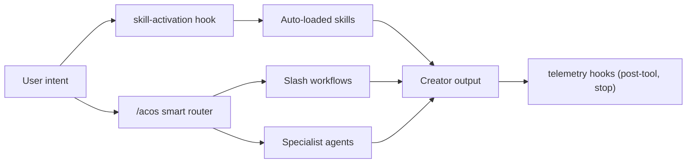

<div align="center">

# Agentic Creator OS

**The open-source operating system for AI-powered creators**

*Skills, commands, agents, and hooks for content, video, music, visual, and brand work — auto-activating inside Claude Code and any AI coding agent.*


[](LICENSE)
[](https://github.com/frankxai/agentic-creator-os/actions/workflows/acos-health-check.yml)
[](STATS.md)

</div>

---

## Install (30 seconds)

**Claude Code (recommended):**

```
/plugin marketplace add frankxai/agentic-creator-os
/plugin install agentic-creator-os@frankx
```

**Any Agent-Skills-compatible tool** (Codex, Cursor, Gemini CLI, Copilot, …):

```bash
npx skills add frankxai/creator-skills
```

**Full control** (all platforms, generates context files for Grok Build, Cursor, Windsurf, Gemini):

```bash
git clone https://github.com/frankxai/agentic-creator-os.git && cd agentic-creator-os && ./install.sh
```

## What You Get

Exact counts are generated from source in [STATS.md](STATS.md) — roughly 100
skills, ~70 command workflows, ~60 agents, and 4 wired telemetry hooks.

```
You: "write a blog post about AI agents with a hero image"
  → skill-activation hook detects: content + image intent
  → auto-loads: content-strategy + multimodal-studio skills
  → routes to: /article-creator + /studio
  → result: article with SEO + on-brand hero image
```

| Layer | What it does |
|---|---|
| **Skills** | Domain knowledge that loads automatically via `.claude/skill-rules.json` |
| **Commands** | Slash workflows: `/studio`, `/article-creator`, `/create-music`, `/factory`, … |
| **Agents** | Specialist personas: writers, editors, strategists, a multimodal director |
| **Hooks** | Telemetry-only: session context, skill activation, post-tool tracking, session finalize |

## Flagship: Multimodal Studio

End-to-end **image + video + consistent characters** across 30+ frontier models
(Soul, Flux, Seedream, Kling, Hailuo, Veo, Sora) through a single MCP connector —
with character consistency across an entire asset set. Vendor-agnostic by
design: any connector filling the `~~image generation` / `~~video generation`
categories works ([CONNECTORS.md](CONNECTORS.md)).

```bash
claude mcp add --transport http --scope user higgsfield https://mcp.higgsfield.ai/mcp
/studio
```

Other production lanes: **music** (`/create-music` — Suno pipeline),
**research-grounded visuals** (`/infogenius`), **books** (`/author-team`),
**publishing** (`/factory`, `/publish`).

## Your Identity, Not Ours

ACOS agents inherit *your* voice from [CREATOR.md](CREATOR.md) — a fill-in
identity contract covering voice, mission, quality bar, and hard constraints.
The core is identity-neutral by contract; `instances/frankx/` holds the worked
example (remaining author-specific residue in core skills is tracked for
removal in [v12.2](docs/ROADMAP.md)).

## Architecture


```mermaid
flowchart LR
  Intent["User intent"] --> Hook["skill-activation hook"]
  Hook --> Skills["Auto-loaded skills"]
  Intent --> Router["/acos smart router"]
  Router --> Commands["Slash workflows"]
  Router --> Agents["Specialist agents"]
  Skills --> Output["Creator output"]
  Commands --> Output
  Agents --> Output
  Output --> Track["telemetry hooks (post-tool, stop)"]
```

Design principles: **progressive disclosure** (lean SKILL.md + `references/`),
**connector agnosticism** (`~~categories`, not vendors), **commands as
workflows** (pure markdown, no hidden code). Full detail:
[docs/ARCHITECTURE.md](docs/ARCHITECTURE.md).

## Honesty Layer

Everything this README claims is enforced by CI on every push:

- [STATS.md](STATS.md) is generated from disk — docs can't drift from reality
- Leak gate — no private paths, telemetry, or internal strategy in the tree
- No empty skills, no activation rules pointing at skills that don't exist

## Related Projects

| Repo | What |
|---|---|
| [creator-skills](https://github.com/frankxai/creator-skills) | Curated creator-lane skills for `npx skills add` |
| [agentic-operating-system-standard](https://github.com/frankxai/agentic-operating-system-standard) | The AOS governance standard ACOS aligns to |
| [Starlight-Intelligence-System](https://github.com/frankxai/Starlight-Intelligence-System) | Sovereign AI substrate (governance protocol) |

## Contributing

PRs welcome — see [CONTRIBUTING.md](CONTRIBUTING.md) (DCO sign-off required).
Good first contributions: add a skill for a creator tool you use, port a
workflow, improve a `references/` pack. Run `node scripts/generate-stats.mjs`
before pushing.

## Credits

ACOS absorbs patterns (with attribution, never wholesale vendoring) from the
open agent ecosystem — see [CREDITS.md](CREDITS.md).

## License

[MIT](LICENSE) © Frank Riemer (FrankX). Use it, fork it, build your own studio
on it. The pro layer (done-for-you setup, premium playbooks, hosted agents)
lives at [frankx.ai/acos](https://frankx.ai/acos).
