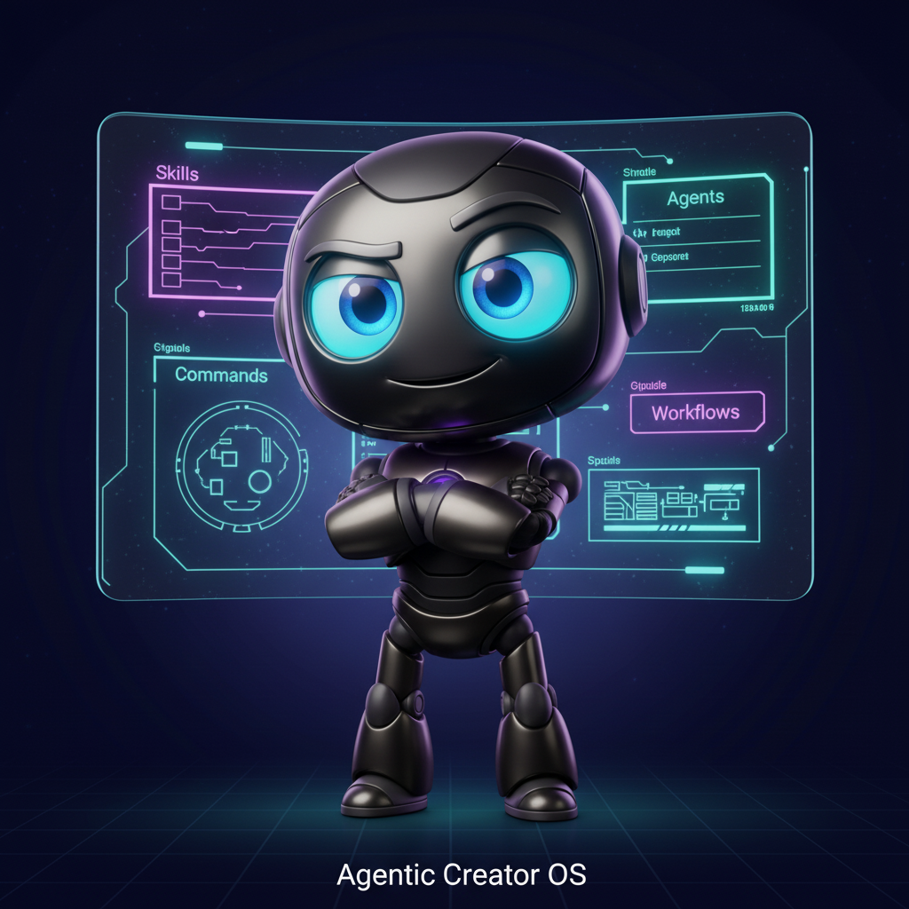
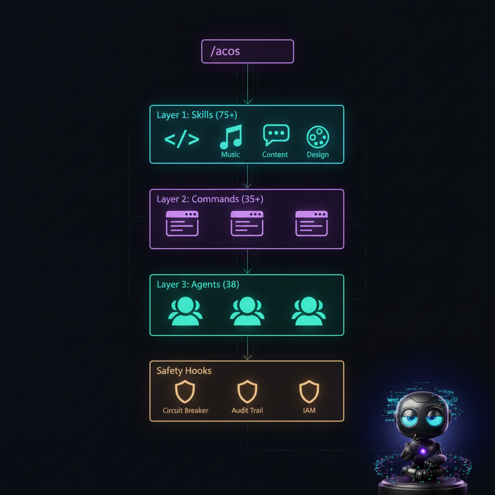
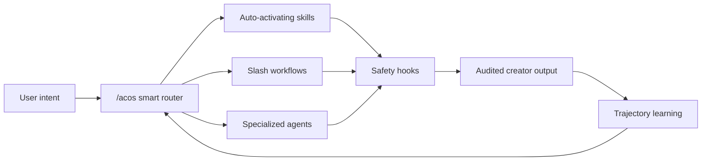
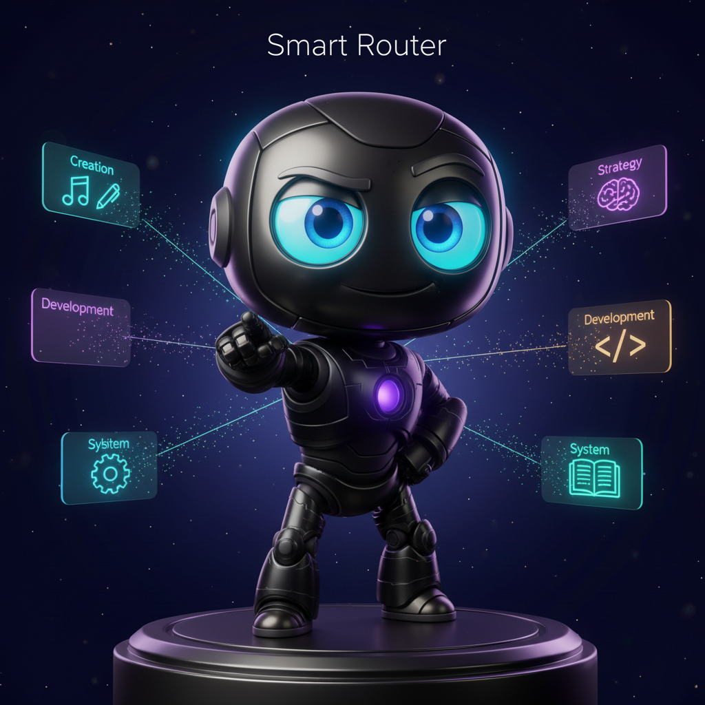
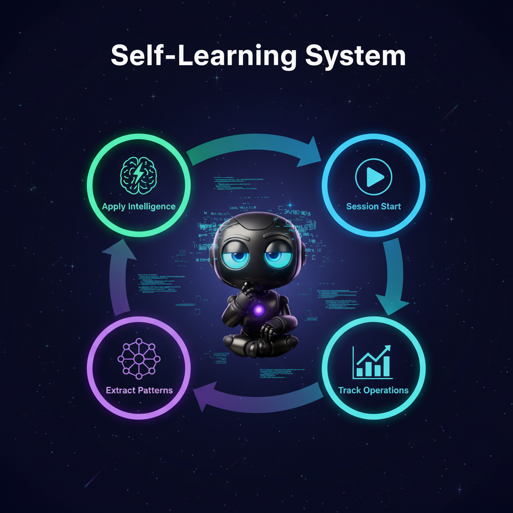

<div align="center">

# Agentic Creator OS

**The Operating System for AI-Powered Creators**

*One install. Any coding agent. 90+ skills, 65+ commands, 38 agents — auto-activating.*



[](https://github.com/frankxai/agentic-creator-os)
[](LICENSE)
[](#multi-platform-install)

</div>

---

## What Is the Agentic Creator OS?

A **production-grade skill and agent system** for AI coding assistants. It ships skills (domain knowledge), commands (reusable workflows), agents (specialized personas), and safety hooks — configured to auto-activate based on what you're working on.

Works with **Claude Code, Grok Build (xAI CLI/TUI — full native harness + .grok/skills + .grok/hooks + subagents + MCP + grok-harness-adapter + Claude compat), Cursor, Windsurf, Gemini Code Assist, Antigravity**, and any AI coding agent that reads markdown context files. Built on SIP (Starlight Intelligence Protocol).

```
You: "write a blog post about AI agents"
  → Agentic Creator OS detects: creation + blog
  → Auto-loads: content-strategy skill
  → Routes to: /article-creator workflow
  → Result: Guided article with SEO, images, social distribution
```

### System Architecture

<div align="center">



</div>

The Agentic Creator OS is structured in four layers, each auto-activating based on context:


```mermaid
flowchart LR
  Intent["User intent"] --> Router["/acos smart router"]
  Router --> Skills["Auto-activating skills"]
  Router --> Commands["Slash workflows"]
  Router --> Agents["Specialized agents"]
  Skills --> Hooks["Safety hooks"]
  Commands --> Hooks
  Agents --> Hooks
  Hooks --> Output["Audited creator output"]
  Output --> Learning["Trajectory learning"]
  Learning --> Router
```

| Layer | What It Does | Count |
|-------|-------------|-------|
| **Skills** | Domain knowledge modules that load automatically | 75+ |
| **Commands** | Reusable workflows triggered via slash commands | 35+ |
| **Agents** | Specialized personas with distinct expertise | 38 |
| **Safety Hooks** | Circuit breaker, audit trail, IAM, self-modify gate | 5 |

## Architecture & Harness Role (Whole Stack)

ACOS (Agentic Creator OS) is the **shared execution layer** (skills + commands + agents + workflows + safety) used across the FrankX / Starlight ecosystem. It is harness-agnostic but provides first-class native adapters for the full fleet.

| Layer | Role | Key |
|-------|------|-----|
| **SIP (Starlight Intelligence Protocol)** | Cross-repo memory, MCP substrate (github/fs-starlight/git), sovereignty, attestation, vaults | starlightintelligence.org/protocol |
| **ACOS** | 90+ skills, 65+ commands, 38 agents, workflows, v10+ safety (IAM, circuit-breaker, audit, self-modify), auto-activation via skill-rules + excellence | This repo; junctions to ~/.claude + .grok compat |
| **Grok Build (xAI)** | TUI speed, subagents (explore/plan), MCP, image/video, .grok/skills + hooks native + full .claude compat. Personal excellence seeds (4 + 2 json) via grok-harness-adapter | adapters/grok/ + install --platform=grok; .grok-only grok-personal layer only |
| **Claude Code** | Canonical full surface (slash commands, hooks, IAM, skill-rules) | Direct .claude/ install |
| **Other (Cursor, Windsurf, Gemini, AGY)** | Context files + embedded skills/agents; delegation via multi-orchestrator | .cursorrules etc. |
| **FrankX / Arcanea** | Brand voice, personal creative, specific verticals (content, music, oracle, etc.) | Overlays + personal .grok/.claude partitions |

**Core vs Grok-Personal vs Personal-Creative Partition (strict):** See SHARING.md + SIP §5. The 4 excellence seeds live ONLY in .grok/ for Grok users ("a bit magical"). Everything else is core/shared via .claude/ junctions. Use sip-share-audit before cross moves. 5-fleet parity + God 99 gates (repo-mastery + gstack + santa/verification) on all work.

This separation + adapters make ACOS the universal substrate: one catalog, many harnesses, governed outputs.

---

## Pre-Compiled Release Packs (No Git Required)

For environments without direct Git access, or for users who want to host specific subsets of the OS, pre-compiled zip packages are hosted at [frankx.ai/downloads](https://frankx.ai/downloads/preview/agentic-creator-os):

- 📦 **[Complete OS Bundle](https://frankx.ai/downloads/preview/agentic-creator-os)** (`acos-complete.zip`): The full codebase, install scripts, daemon, and all modules.
- 🧩 **[Skills Pack](https://frankx.ai/downloads/preview/agentic-creator-os)** (`acos-skills-pack.zip`): Standalone catalog of 90+ auto-activating skills.
- 👥 **[Agent Pack](https://frankx.ai/downloads/preview/agentic-creator-os)** (`acos-agents-pack.zip`): Specialized personas, prompts, and swarm layouts.
- ⚓ **[Hooks Pack](https://frankx.ai/downloads/preview/agentic-creator-os)** (`acos-hooks-pack.zip`): Git pre-commit, partition, and safety gates.

Download the package, unzip it into your workspace root, and run `./install.sh --platform=<your-platform>` to finalize setup.

---

## Quick Start — Platform Installation

ACOS v14.0.0 provides first-class, native adapters for all major agentic fleets. Run the commands below to configure your specific workspace:

| Target Platform | Install Command | Context File Created |
|---|---|---|
| **Claude Code** | `./install.sh --platform=claude` | `~/.claude/` directories & junctions |
| **Google Antigravity** | `./install.sh --platform=antigravity` | `.antigravity/` & `.antigravityrules` |
| **OpenAI Codex** | `./install.sh --platform=codex` | `.codex/` & `.codexrules` |
| **xAI Grok Build** | `./install.sh --platform=grok` | `.grok/` & `GROK.md` |
| **Cursor / Windsurf** | `./install.sh --platform=cursor` | `.cursorrules` / `.windsurfrules` |
| **Gemini Assist** | `./install.sh --platform=gemini` | `GEMINI.md` |

---

### 1. Claude Code (Full Feature Set)
```bash
git clone https://github.com/frankxai/agentic-creator-os.git
cd agentic-creator-os
./install.sh --platform=claude

# Open any project with Claude Code
claude
/acos
```

### 2. Google Antigravity (AGY)
```bash
git clone https://github.com/frankxai/agentic-creator-os.git
cd agentic-creator-os
./install.sh --platform=antigravity

# Open workspace in Antigravity
agy
```

### 3. OpenAI Codex
```bash
git clone https://github.com/frankxai/agentic-creator-os.git
cd agentic-creator-os
./install.sh --platform=codex

# Open workspace in Codex
cfx
```

### 4. xAI Grok Build (xAI CLI/TUI)
```bash
git clone https://github.com/frankxai/agentic-creator-os.git
cd agentic-creator-os
./install.sh --platform=grok

# Run grok in project
grok
/hooks-trust
/skills harness-integration
```

### 5. Cursor / Windsurf
```bash
git clone https://github.com/frankxai/agentic-creator-os.git
cd agentic-creator-os
./install.sh --platform=cursor    # or --platform=windsurf
```

### 6. Gemini Code Assist
```bash
git clone https://github.com/frankxai/agentic-creator-os.git
cd agentic-creator-os
./install.sh --platform=gemini
```

> **See [QUICKSTART.md](QUICKSTART.md) for detailed setup per platform**

---

## Core Concepts

The Agentic Creator OS is built around six foundational concepts. Understanding these unlocks the full system.

### Skills — Auto-Activating Domain Knowledge

Skills are markdown files containing deep domain expertise. They **activate automatically** when the Agentic Creator OS detects relevant context in your work.

```
You start writing a blog post
  → skill-rules.json matches: "blog" + "write"
  → Auto-loads: content-strategy + seo-content-writer + schema-markup
  → Your AI agent now has SEO expertise, content structure, and metadata knowledge
```

| Skill Category | Examples | Trigger Patterns |
|---------------|----------|-----------------|
| **Technical** | TDD, React patterns, TypeScript, debugging | `test`, `component`, `error` |
| **Creative** | Brand voice, music mastery, book writing | `blog`, `music`, `create` |
| **Infrastructure** | Oracle Cloud, Kubernetes, Terraform | `deploy`, `cloud`, `infra` |
| **Business** | Product management, financial modeling | `product`, `strategy`, `pricing` |

### Commands — Reusable Slash Workflows

Commands are multi-step workflows triggered by a single slash command. Each command orchestrates skills, agents, and tools in sequence.

| Command | What It Does | Steps |
|---------|-------------|-------|
| `/studio` | Multimodal production | Brief → Route model → Craft → Generate (async) → Assemble |
| `/article-creator` | Full blog pipeline | Research → Outline → Draft → SEO → Images → Social |
| `/factory` | Mass content production | Batch input → Parallel agents → Quality gate → Export |
| `/spec` | Feature specification | Requirements → Design → Task breakdown → Validation |
| `/infogenius` | Visual intelligence | Topic → Research → 4K image generation → Metadata |
| `/create-music` | Music production | Genre → Prompt engineering → Generation → Metadata |
| `/council` | Strategic decisions | Multi-agent deliberation → Weighted synthesis → Verdict |

### Agents — Specialized AI Personas

Each agent has distinct expertise, voice, and tool access. The Agentic Creator OS routes to the best agent based on task type.

| Agent | Specialty | When It Activates |
|-------|----------|------------------|
| **Developmental Editor** | Story structure, pacing, narrative architecture | Book/long-form writing |
| **Music Producer** | Suno prompts, genre production, audio engineering | Music creation |
| **Technical Architect** | System design, Oracle Cloud, enterprise patterns | Architecture tasks |
| **UI/UX Expert** | Design systems, accessibility, Figma integration | Frontend work |
| **SEO Intelligence** | Keywords, citations, structured data | Content optimization |
| **Starlight Orchestrator** | Multi-agent coordination, strategic decisions | Complex workflows |

### Smart Router — Intent-Based Routing

The `/acos` command analyzes your request and routes to the optimal subsystem:

```
/acos "create an infographic about machine learning"
  ├── Intent detected: visual + educational
  ├── Agent selected: Visual Creator
  ├── Skills loaded: infogenius, design-excellence
  ├── Command chain: /research → /infogenius
  └── Output: 4K infographic with research-grounded content
```

### Multimodal Studio — Image · Video · Character

One connector, every modality. ACOS generates **images, video, and consistent characters** across 30+ frontier models through a single MCP — model-agnostic, brand-locked, and async by default.

```text
/studio "hero image + 3 social cards + 5s teaser for the launch post"
  ├── Routes each shot to the right model (Soul/Flux → stills, Kling/Veo → motion)
  ├── Holds one character across the whole set via create_character → reuse ID
  ├── Submits assets in parallel, polls for results, downloads to canonical paths
  └── Output: a coherent, brand-locked campaign — not disconnected one-off images
```

| Modality | Models (via Higgsfield MCP) | Differentiator |
|----------|------------------------------|----------------|
| **Image** | Soul (4K), Flux, Seedream, Nano Banana | Brand tokens injected per asset |
| **Video** | Kling, Hailuo, Veo, Sora-class, DoP | Image→video first (cheaper, keeps composition) |
| **Character** | Soul character training | One reference, identical across an entire series |

Skill: `multimodal-studio` · Agent: Multimodal Director · Commands: `/studio`, `/generate-video`. Connect: `claude mcp add --transport http --scope user higgsfield https://mcp.higgsfield.ai/mcp`. Stays vendor-agnostic — any MCP filling `~~image generation` / `~~video generation` works (`CONNECTORS.md`). Full guide + the ACOS-vs-Antigravity positioning: [`docs/multimodal-studio.md`](docs/multimodal-studio.md).

### Safety Hooks — Autonomous Protection

Five systems that run automatically to keep the Agentic Creator OS reliable:

| Hook | What It Prevents |
|------|-----------------|
| **Circuit Breaker** | Stops the agent from brute-forcing broken approaches (3→warn, 5→restrict, 8→block) |
| **Audit Trail** | Append-only JSONL log of every operation — tamper-proof ground truth |
| **Agent IAM** | Role-based scoping — a content writer can't modify build configs |
| **Self-Modify Gate** | Snapshots state before config changes, auto-reverts if intelligence drops |
| **Quality Gate** | Blocks edits to secrets files, warns on production file modifications |

### Self-Learning — Gets Smarter Every Session

The Agentic Creator OS tracks tool sequences and outcomes across sessions, then injects successful patterns as context for similar future tasks. No external API — pure local intelligence.

---

## v10 — Autonomous Intelligence

v10 introduces **5 safety-first autonomous systems** that make your AI coding agent smarter over time:

### 1. Experience Replay
The agent remembers what worked. Past successful tool sequences are injected as context for similar new tasks.

### 2. Agent IAM (Identity & Access Management)
Per-profile scoping — a content writer can't modify your build config, a music producer can't run shell commands. 6 profiles with tool and directory restrictions.

### 3. Confidence Circuit Breaker
Tracks failures per file. After 3 failures: warn. After 5: restrict. After 8: block. Prevents the agent from brute-forcing broken approaches.

### 4. Conservative Self-Modify Gate
Before changing its own config, ACOS snapshots the current state and measures intelligence score. If the score drops more than 5 points after a change: auto-revert.

### 5. Immutable Audit Trail
Append-only JSONL logging of every tool use, IAM decision, gate verdict, and config change. The ground truth for what happened in a session.

<details>
<summary><strong>v10 Architecture Diagram</strong></summary>

```
                        /acos (Smart Router)
                            |
              +-------------+-------------+
              |             |             |
         Commands (35+)  Skills (75+)  Agents (38)
              |             |             |
              +------+------+------+------+
                     |             |
              +------+------+  +--+--+
              |             |  |     |
          Hooks (v10)   Workflows  MCP Servers
              |
    +---------+---------+---------+
    |         |         |         |
 Circuit   Audit    Self-Mod   Agent
 Breaker   Trail    Gate       IAM
```
</details>

---

## What's Included

### Commands (35+)

| Category | Count | Examples |
|----------|-------|----------|
| **Creation** | 12 | `/studio`, `/generate-video`, `/article-creator`, `/create-music`, `/infogenius`, `/factory` |
| **Strategy** | 6 | `/starlight-architect`, `/council`, `/research`, `/plan-week` |
| **Development** | 4 | `/spec`, `/nextjs-deploy`, `/ux-design`, `/automation-dev` |
| **System** | 5 | `/acos`, `/inventory-status`, `/mcp-status`, `/publish` |
| **Quality** | 3 | `/review-content`, `/classify-content`, `/polish-content` |

> Commands are Claude Code slash commands. On other platforms, describe the task and ACOS skills guide the agent to the same workflows.

### Skills (75+ Auto-Activating)

Skills are domain knowledge modules that **activate automatically** based on what you're doing. No manual invocation needed.

| Category | Count | Examples |
|----------|-------|----------|
| **Technical** | 25+ | TDD, systematic-debugging, mcp-architecture, react-nextjs-patterns |
| **Creative** | 10+ | multimodal-studio, frankx-brand, suno-ai-mastery, excellence-book-writing |
| **Content** | 15+ | content-strategy, social-media-strategy, video-production |
| **Oracle/Cloud** | 5+ | oci-services-expert, oracle-database-expert, oracle-ai-architect |
| **Business** | 5+ | product-management, coaching-program, financial-modeling |
| **System** | 15+ | swarm-orchestration, agentic-jujutsu, planning-with-files |
| **Personal** | 5+ | spartan-warrior, gym-training, health-nutrition |

**How Auto-Activation Works:**
```
skill-rules.json → 22 pattern rules
  "tests" + "component" → loads test-driven-development + react-patterns
  "blog" + "write"      → loads content-strategy + seo-content-writer
  "deploy" + "vercel"   → loads vercel-deployment + nextjs-best-practices
```

### Agents (38 Specialized)

| Domain | Agents | Examples |
|--------|--------|----------|
| **Writing** | 8 | Developmental Editor, Line Editor, Content Polisher, Story Architect |
| **Strategy** | 5 | Starlight Orchestrator, Visionary, Oracle AI Architect |
| **Design** | 4 | UI/UX Expert, Website Builder, Frankx Content Creation |
| **Production** | 5 | Multimodal Director, Music Production, Sonic Engineer, Nano Banana Image Gen |
| **Business** | 4 | Product Launch, Coaching Program, Product Development |
| **Technical** | 5 | Technical Architect, Oracle Database, OpenAI AgentKit |
| **Publishing** | 6 | Master Story Architect, Character Psychologist, Sensitivity Reader |
| **System** | 3 | Skill Expert, Project Discovery, Rapid Content |

### v10 Safety Hooks

| Hook | Trigger | Purpose |
|------|---------|---------|
| **Circuit Breaker** | PostToolUse (failure) | Track failures per file, escalate at thresholds |
| **Audit Trail** | All tool use | Append-only JSONL logging |
| **Self-Modify Gate** | Config changes | Snapshot + validate intelligence score |
| **Agent IAM** | PreToolUse | Enforce per-profile tool/path scopes |
| **Quality Gate** | PreToolUse (Edit/Write) | Block edits to secrets, warn on production files |

---

## How It Works

### The `/acos` Smart Router

<div align="center">



</div>

Everything starts with `/acos`. It parses intent and routes to the best subsystem:

```
/acos "write a blog post about AI agents"
  → Detects: creation + blog
  → Routes to: /article-creator
  → Auto-loads: content-strategy skill
  → Result: Guided article creation workflow
```

For multi-domain requests, it chains commands:
```
/acos "Create a blog post about AI music with images and social posts"
  → /research "AI music production"
  → /article-creator (with research context)
  → /infogenius (hero image)
  → /generate-social (distribution)
```

### Orchestration Patterns

| Pattern | Description | Best For |
|---------|-------------|----------|
| **Pipeline** | Sequential: Research → Plan → Create → Optimize → Publish | Blog posts, newsletters |
| **Parallel** | Concurrent agents with synthesis | Code review, multi-analysis |
| **Weighted Synthesis** | Expert voting with percentage weights | Strategic decisions |

### Self-Learning

<div align="center">



</div>

The Agentic Creator OS learns from every session through a four-stage cycle:

| Stage | What Happens |
|-------|-------------|
| **1. Session Start** | Creates a trajectory record for the current session |
| **2. Track Operations** | Monitors tool sequences, file changes, and outcomes |
| **3. Extract Patterns** | Identifies successful workflows and tool combinations |
| **4. Apply Intelligence** | Injects learned patterns as context for future sessions |

```
Session Start → Create trajectory record
Session Active → Track operations and outcomes
Session End → Extract patterns → Store learnings
Future Sessions → Apply accumulated intelligence
```

---

## Multi-Platform Install

<a id="multi-platform-install"></a>

The install script detects your platform and configures accordingly:

```bash
./install.sh                      # Auto-detect platforms
./install.sh --platform=claude    # Claude Code only
./install.sh --platform=cursor    # Cursor only
./install.sh --platform=windsurf  # Windsurf only
./install.sh --platform=gemini    # Gemini Code Assist only
./install.sh --platform=grok      # Grok full (GROK.md + .grok/ seeds from grok-harness-adapter)
./install.sh --platform=generic   # Any agent (CONTEXT.md)
./install.sh --platform=all       # All detected platforms
```

### What Gets Installed Per Platform

| Component | Claude Code | Grok Build (xAI) | Cursor | Windsurf | Gemini | Generic |
|-----------|:-----------:|:----:|:------:|:--------:|:------:|:-------:|
| Skills (knowledge) | ~/.claude/skills/ | .grok/skills/ + GROK.md + ~/.claude compat (via grok-harness-adapter seeds) | .cursorrules | .windsurfrules | GEMINI.md | CONTEXT.md |
| Commands (workflows) | ~/.claude/commands/ | Context + native /skills + subagents | — | — | — | — |
| Agents (personas) | ~/.claude/agents/ | .grok/agents/ + subagents | .cursorrules | .windsurfrules | GEMINI.md | CONTEXT.md |
| Hooks (safety) | settings.json + acos/hooks | .grok/hooks/ (trust with /hooks-trust) + excellence gates | — | — | — | — |
| Auto-activation | skill-rules.json | harness-integration + excellence-review seeds (gstack/santa/verification) | — | — | — | — |
| MCP servers | Optional | — | — | — | — |

> **Claude Code gets the full feature set** including slash commands, lifecycle hooks, and auto-activation rules. Other platforms get skills and agent definitions embedded in their context files.

---

## Directory Structure

```
agentic-creator-os/
├── .claude/
│   ├── commands/           # 35+ slash commands
│   ├── skills/             # 75+ auto-activating skills
│   ├── agents/             # 38 specialized agents
│   ├── hooks/              # v10 safety hooks
│   │   ├── circuit-breaker.sh
│   │   ├── audit-trail.sh
│   │   ├── self-modify-gate.sh
│   │   └── quality-gate.sh
│   ├── agent-iam.json      # Role-based access control
│   ├── skill-rules.json    # 22 auto-activation rules
│   └── hooks.json          # Hook lifecycle config
│
├── adapters/               # Platform adapters (TS context + seed generators)
│   ├── grok/               # grok-harness-adapter: index.ts (isGrok, parse, generateGrokContext, getGrokSeeds, installGrokPlatform), GROK excellence seeds
│   ├── opencode/           # OpenCode integration adapter
│   ├── cursor/             # .cursorrules generator (planned)
│   ├── windsurf/           # .windsurfrules generator (planned)
│   ├── gemini/             # GEMINI.md generator (planned)
│   └── generic/            # CONTEXT.md generator (planned)
│
├── departments/            # Agent team definitions
│   ├── content/
│   ├── design/
│   ├── dev/
│   ├── marketing/
│   └── business/
│
├── mcp-servers/            # MCP integrations (optional)
├── templates/              # Reusable templates
├── workflows/              # Workflow definitions
├── docs/infographics/      # Visual documentation
├── install.sh              # Multi-platform installer
├── CLAUDE.md               # Claude Code context
└── package.json            # v10.1.0
```

---

## The Starlight Connection

ACOS is the **Claude Code implementation** of the [Starlight Intelligence System](https://github.com/frankxai/Starlight-Intelligence-System) — a universal, platform-agnostic framework for multi-agent orchestration.

```
Starlight Intelligence System (Framework)
├── 5-layer cognitive architecture
├── 7 council agents with emergent leadership
├── 6 orchestration patterns
└── Platform adapters
     └── ACOS (Claude Code + Grok full harness via grok-harness-adapter + Multi-Platform)
         ├── 35+ commands routed through /acos
         └── Grok: adapters/grok/index.ts + install.sh --platform=grok (GROK.md + .grok/ seeds: excellence, repo-mastery, gstack gates)
         ├── 38 agents aligned to Starlight council
         ├── 75+ auto-activating skills
         ├── v10 safety systems (IAM, circuit breaker, audit)
         └── Self-learning via trajectory patterns
```

---

## Design Principles

1. **Configuration over Code** — Markdown + JSON + AI's native abilities. Zero install friction.
2. **Commands over Prompts** — Reusable workflows beat one-off prompts. Build once, use forever.
3. **Agents over Chat** — Specialized expertise beats general conversation.
4. **Files over Memory** — Persistent artifacts beat ephemeral threads. Everything is git-trackable.
5. **Progressive Disclosure** — Load only what you need. ~100 tokens metadata before 5K skill definition.
6. **Open and Forkable** — MIT licensed. Every component replaceable.

---

## Plugin Marketplace

Extend ACOS with installable domain plugins from **[agentic-creator-skills](https://github.com/frankxai/agentic-creator-skills)**:

| Plugin | Purpose |
|--------|---------|
| **core** | Session management, workspace memory, task tracking |
| **content-engine** | Content creation, voice enforcement, publishing |
| **visual-studio** | Style-governed image generation, 7-gate quality filter |
| **music-lab** | AI music production, Suno prompt engineering |
| **brand-architect** | Brand voice system, tone adaptation, terminology |
| **product-launcher** | Product specs, sprint management, deployment |
| **intelligence** | Intelligence scoring, pattern analysis, reporting |
| **design-excellence** | Design system governance, 5-gate QA, Figma integration |

```bash
# Install plugins (Claude Code)
claude plugin marketplace add frankxai/agentic-creator-skills
claude plugin install core content-engine design-excellence
```

> ACOS = the operating system. Plugins = the app store. Install only what you need.

---

## Version History

| Version | Date | Highlights |
|---------|------|------------|
| **v14.0** | June 2026 | Stateful sprint gating state machine, Named Pipe/Socket keep-alive daemon (`acosd`), tool-masking profiles, SQLite Trajectory Memory (AgentDB), Nous Hermes XML steering. |
| **v13.0** | June 2026 | Pure JS/TS setup engine installer, raw ANSI TUI statusline & dashboard, git pre-commit security partition hooks, swarm topologies framework. |
| **v11.0** | Feb 2026 | Plugin ecosystem, design swarm, v11 skills absorbed from acos-intelligence-system |
| v10.1 | Feb 2026 | Deep clean — removed claude-flow artifacts, honest metrics, clean repo |
| v10.0 | Feb 2026 | Autonomous Intelligence — 5 safety systems, multi-platform, Agent IAM |
| v8.0 | Feb 2026 | Starlight integration, GitHub release assets, swarm orchestration |
| v7.0 | Feb 2026 | Visionary agent, premium infographics, expanded commands |
| v6.0 | Jan 2026 | Smart router (/acos), auto-activation, hooks |
| v5.0 | Jan 2026 | 7-pillar architecture, 62 skills, swarm topologies |
| v4.0 | Jan 2026 | Initial release, 14 commands, basic skills |

---

## Credits & Attribution

ACOS builds on work from the open-source community:

| Project | Author | What We Learned |
|---------|--------|-----------------|
| [claude-flow](https://github.com/ruvnet/claude-flow) | @ruvnet | Swarm orchestration, hierarchical topologies |
| [wshobson/agents](https://github.com/wshobson/agents) | @wshobson | Plugin architecture, modular skills |
| [obra/superpowers](https://github.com/obra/superpowers) | @obra | Progressive disclosure, token-efficient loading |
| [diet103/claude-code-infrastructure-showcase](https://github.com/diet103/claude-code-infrastructure-showcase) | @diet103 | `skill-rules.json` auto-activation pattern |
| [ChrisWiles/claude-code-showcase](https://github.com/ChrisWiles/claude-code-showcase) | @ChrisWiles | Hook automation patterns |
| [Pimzino/claude-code-spec-workflow](https://github.com/Pimzino/claude-code-spec-workflow) | @Pimzino | Spec-driven development |
| [github/github-mcp-server](https://github.com/github/github-mcp-server) | GitHub | Official GitHub MCP server |
| [agentic-jujutsu](https://github.com/ruvnet/agentic-jujutsu) | @ruvnet | Self-learning trajectory patterns |

**Built on:** [Claude Code](https://claude.ai/claude-code) by Anthropic, [Model Context Protocol](https://modelcontextprotocol.io/)

---

## Related Projects

- **[agentic-creator-skills](https://github.com/frankxai/agentic-creator-skills)** — Plugin marketplace (8 domain plugins)
- **[Starlight Intelligence System](https://github.com/frankxai/Starlight-Intelligence-System)** — The universal framework powering ACOS
- **[Arcanea](https://github.com/frankxai/arcanea)** — AI-native creative platform built with ACOS

---

## License

MIT — Use it, fork it, build your own OS with it.

---

<div align="center">

**Agentic Creator OS v14.0** — The Operating System for AI-Powered Creators

*90+ Skills | 65+ Commands | 38 Agents | 8 Plugins | Multi-Platform | Self-Learning*

Built by [FrankX](https://frankx.ai) — AI Architect & Creator

[GitHub](https://github.com/frankxai/agentic-creator-os) | [Website](https://frankx.ai/acos) | [Issues](https://github.com/frankxai/agentic-creator-os/issues)

</div>
