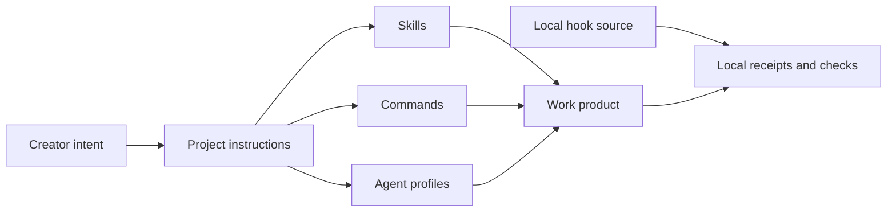

<div align="center">

# Agentic Creator OS

Reusable skills, commands, agent profiles, and local safety tooling for AI-assisted creative work.

[Quick start](QUICKSTART.md) · [Project instructions](CLAUDE.md) · [Contributing](CONTRIBUTING.md) · [Issues](https://github.com/frankxai/agentic-creator-os/issues)

</div>

## What this repository is

Agentic Creator OS (ACOS) is a public source repository for creator workflows that can be loaded into Claude Code or rendered as context for other coding agents. It contains:

- domain skills written as `SKILL.md` modules;
- top-level slash-command definitions for Claude Code;
- specialist agent profiles;
- local hook source and configuration;
- generators for Cursor, Windsurf, Gemini, Grok, Antigravity, and generic context files;
- MCP server workspaces and an observatory catalog.

ACOS is a source distribution, not a hosted service. The current version metadata is `11.0.0`.

## Verified public surface

The repository currently contains:

| Surface | Count | Definition |
|---|---:|---|
| Non-empty skill modules | 171 | Non-empty `.claude/skills/**/SKILL.md` files |
| Empty skill placeholders | 5 | Tracked `SKILL.md` paths with no content; not counted as modules |
| Top-level slash commands | 83 | `.claude/commands/*.md`, excluding the directory context file |
| Top-level agent profiles | 69 | `.claude/agents/*.{md,json}`, excluding the directory context file |
| Installable shell hooks | 9 | Top-level `.claude/hooks/*.sh` files copied by the Claude installer |
| Activation rules | 32 | Entries in `.claude/skill-rules.json` |

These numbers are generated from the tree. `npm run verify:public-surface` fails if the counts, version metadata, install smoke test, or public license and marketplace statements drift.

## Install from source

The verified installation path is the repository installer:

```bash
git clone https://github.com/frankxai/agentic-creator-os.git
cd agentic-creator-os
./install.sh --platform=claude
```

The Claude path copies the repository's skill groups, top-level commands, agent profiles, shell hooks, hook configuration, activation rules, and state metadata into `CLAUDE_HOME` (or `~/.claude` by default).

Before installing into an existing profile, inspect the script and back up any files with matching names. The installer copies files into shared directories and can replace same-named files.

For an isolated inspection:

```bash
export CLAUDE_HOME="$(mktemp -d)"
./install.sh --platform=claude --minimal
find "$CLAUDE_HOME" -maxdepth 2 -type f | sort
```

Other platform flags generate context or harness-specific files:

```bash
./install.sh --platform=cursor
./install.sh --platform=windsurf
./install.sh --platform=gemini
./install.sh --platform=grok
./install.sh --platform=antigravity
./install.sh --platform=generic
```

Those generators are present in the tree. They should not be read as a claim that every external harness or third-party connector has been independently certified end to end.

## Claude plugin status

This repository includes `.claude-plugin/plugin.json`, but it does not include `.claude-plugin/marketplace.json`. It is therefore not currently presented as a Claude marketplace installation.

Use the source installer above. The separate [agentic-creator-skills](https://github.com/frankxai/agentic-creator-skills) repository is the companion plugin catalog; evaluate its installation instructions and license independently.

## How the pieces fit


```mermaid
flowchart LR
  Intent["Creator intent"] --> Instructions["Project instructions"]
  Instructions --> Skills["Skills"]
  Instructions --> Commands["Commands"]
  Instructions --> Agents["Agent profiles"]
  Skills --> Work["Work product"]
  Commands --> Work
  Agents --> Work
  Hooks["Local hook source"] --> Evidence["Local receipts and checks"]
  Work --> Evidence
```

The files provide instructions and tooling. Whether a skill activates, a command is available, or a hook executes depends on the target harness and its local configuration.

## Start with the system

After installation, inspect these entry points:

```text
CLAUDE.md                    Project behavior and command map
AGENTS.md                    Repository-specific agent instructions
.claude/skill-rules.json     Activation rules
.claude/commands/acos.md     Main router command
.claude/skills/              Skill source
.claude/agents/              Agent profiles
.claude/hooks/               Hook source
```

Useful first prompts:

```text
Read CLAUDE.md and AGENTS.md, then show the ACOS capabilities relevant to this repository.
Plan a creator workflow using only skills that exist in .claude/skills.
Review the proposed workflow and identify every external dependency before execution.
```

## Verification

```bash
npm install --no-audit --no-fund
npm run verify:public-surface
npm run lint
npm run observatory:test
npm run build:all
```

The public-surface verifier performs an isolated Claude install smoke test. The
main CI installs dependencies, verifies the public surface, builds and lints the
MCP workspaces, and runs their type checks as a blocking gate.

## Release discipline

Changes to public claims should answer four questions:

1. What source file proves the claim?
2. What check prevents it from drifting?
3. What external dependency remains unverified?
4. What named-owner decision is still required?

Large resets should be split by concern. Documentation truth, installer behavior, hook wiring, third-party code provenance, legal terms, and marketplace distribution have different review and approval requirements.

## Related public systems

- [Starlight Intelligence System](https://github.com/frankxai/Starlight-Intelligence-System) — system architecture and orchestration
- [agentic-creator-skills](https://github.com/frankxai/agentic-creator-skills) — companion skill and plugin catalog
- [Creator Intelligence System](https://github.com/frankxai/creator-intelligence-system) — creator intelligence research and implementation
- [FrankX](https://github.com/frankxai/FrankX) — public ecosystem index

## License status

No project-wide license file is published in this repository at present. Do not assume permission to copy, modify, or redistribute the repository as a whole.

Some bundled components carry their own license files. Those component-specific terms do not establish terms for the entire repository. A repository owner must choose and publish project-wide terms before a broad reuse claim can be made.

## Contributing

Read [CONTRIBUTING.md](CONTRIBUTING.md) and the nearest `AGENTS.md` or `CLAUDE.md` before editing. Keep changes narrow, preserve existing safety boundaries, and attach commands or artifacts that let another reviewer reproduce the result.
