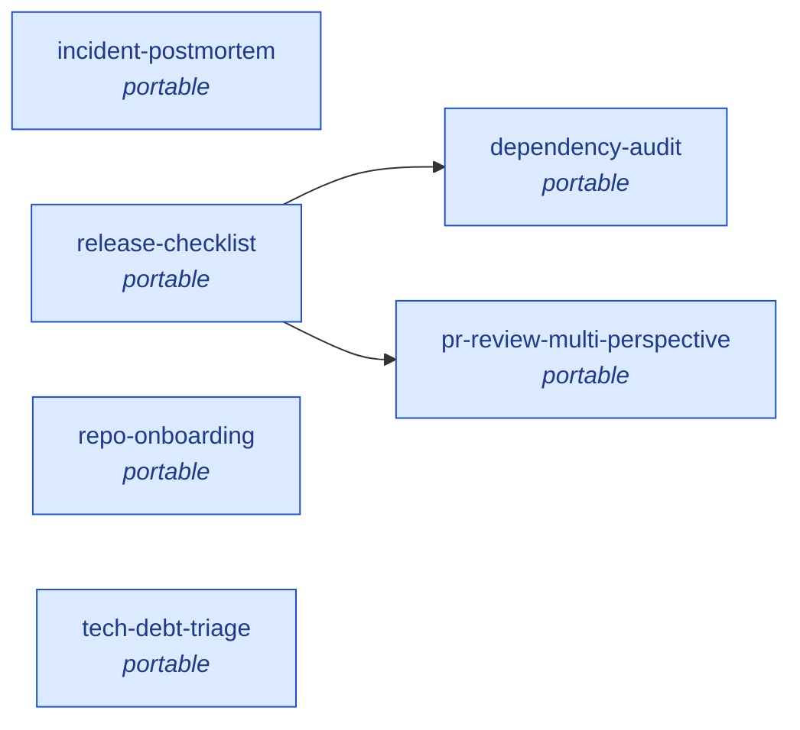

# Workflow Catalog

_Auto-generated by `node scripts/workflow-catalog.mjs write`. Source of truth: `.claude/workflows/`._

**Total:** 6 workflows · **Portable (ACOS-shippable):** 6 · **FrankX-local:** 0
**Cost envelope (sum of one run of each):** 520k–1750k output tokens

## At a glance

| Workflow | Tier | Cadence | Portable | Cost (out tok) | Phases | Composes | Composed by |
|---|---|---|---|---|---|---|---|
| `dependency-audit` | L99 | monthly | yes | 40k–150k | 2 | — | release-checklist |
| `incident-postmortem` | L99 | per-incident | yes | 80k–300k | 3 | — | — |
| `pr-review-multi-perspective` | L99 | per-pr | yes | 80k–350k | 4 | — | release-checklist |
| `release-checklist` | L99 | per-release | yes | 100k–400k | 2 | dependency-audit, pr-review-multi-perspective | — |
| `repo-onboarding` | L99 | on-demand | yes | 120k–200k | 2 | — | — |
| `tech-debt-triage` | L99 | quarterly | yes | 100k–350k | 3 | — | — |

## Composition graph



## How to observe a run

- **Live progress:** the `/workflows` slash command shows running workflows with per-phase, per-agent status.
- **Run identifiers:** every `Workflow({...})` call returns a `runId` — use it to grep transcript logs.
- **Token accounting:** pass a `+500k`-style directive to cap total output tokens. Workflows respect `budget.remaining()` and refuse to spawn agents past the ceiling.
- **Catalog regeneration:** `node scripts/workflow-catalog.mjs write` regenerates this file.
- **JSON dump (for tooling):** `node scripts/workflow-catalog.mjs json > workflows.json`
- **Mermaid only:** `node scripts/workflow-catalog.mjs mermaid`

## How to invoke

```js
// In a Claude Code session, ask for the Workflow tool:
// 'Run the pre-deploy-sweep workflow'
// Or programmatically via tool call:
Workflow({ name: 'pre-deploy-sweep', args: { baseRef: 'main' } })
```

## Portability contract

Workflows tagged `portable: true` ship to the ACOS repo for general use. They:
- Make no assumption about repo-specific paths (FrankX-only paths live in `acos.portable: false`).
- Auto-detect package manager / test framework / language conventions.
- Compose only other portable workflows.
- Carry self-contained schemas (no external type imports).

## Workflows

### `dependency-audit`

Dependency health audit. Parallel: security CVEs, license compliance, outdated versions, bundle size, supply-chain risk, dead deps. Ranked action list with impact × effort.

**When to use:** Monthly per repo, before major releases, or when adding a significant new dependency. Surface critical security findings immediately.

**Phases:** Scan → Rank

**Tier:** L99 · **Cadence:** monthly · **Portable:** yes · **Est. cost:** 40k–150k tokens

**Invoke:**
```js
Workflow({ name: 'dependency-audit', args: { /* see dependency-audit.js */ } })
```

### `incident-postmortem`

Post-incident analysis. Parallel evidence gathering (timeline + impact + context) → root cause + contributing factors → blameless postmortem markdown ready for team review.

**When to use:** After any production incident or near-miss. Output is a blameless postmortem ready for team review and action-item tracking.

**Phases:** Gather → Analyze → Compose

**Tier:** L99 · **Cadence:** per-incident · **Portable:** yes · **Est. cost:** 80k–300k tokens

**Invoke:**
```js
Workflow({ name: 'incident-postmortem', args: { /* see incident-postmortem.js */ } })
```

### `pr-review-multi-perspective`

Multi-perspective PR review with adversarial verification. Pipeline: 6 dimensions reviewed in parallel → each finding adversarially verified by an independent agent → synthesis. Only confirmed findings surface.

**When to use:** Before merging any non-trivial PR. Skip for typo fixes or single-line config tweaks. Especially valuable for shared components, API surfaces, or anything user-facing.

**Phases:** Discover → Review → Verify → Synthesize

**Tier:** L99 · **Cadence:** per-pr · **Portable:** yes · **Est. cost:** 80k–350k tokens

**Invoke:**
```js
Workflow({ name: 'pr-review-multi-perspective', args: { /* see pr-review-multi-perspective.js */ } })
```

### `release-checklist`

Pre-release validation gate. Parallel: tests, changelog, version bumps, migration docs, rollback plan + composes dependency-audit. Optional pr-review-multi-perspective sub-call. Pass/fail verdict on whether to ship.

**When to use:** Before tagging a release, publishing a package, or cutting a release branch. Any repo with semver discipline benefits.

**Phases:** Validate → Gate

**Tier:** L99 · **Cadence:** per-release · **Portable:** yes · **Est. cost:** 100k–400k tokens

**Invoke:**
```js
Workflow({ name: 'release-checklist', args: { /* see release-checklist.js */ } })
```

### `repo-onboarding`

Cold-start understanding of a repo. Parallel: architecture, data flow, dependencies, conventions, recent activity, gotchas. Synthesize into operating brief with first-task recommendations.

**When to use:** When joining a new repo, returning after a long absence, or onboarding a teammate. Also useful when an AI agent encounters an unfamiliar codebase.

**Phases:** Scan → Synthesize

**Tier:** L99 · **Cadence:** on-demand · **Portable:** yes · **Est. cost:** 120k–200k tokens

**Invoke:**
```js
Workflow({ name: 'repo-onboarding', args: { /* see repo-onboarding.js */ } })
```

### `tech-debt-triage`

Code-smell scan + priority ranking. Parallel: complexity, duplication, outdated patterns, test gaps, doc gaps. Output: ranked findings in 3 buckets + concrete fix proposals for top items.

**When to use:** Quarterly per repo, or when planning a refactor sprint. Helps prioritize what to actually fix vs. defer.

**Phases:** Scan → Rank → Propose

**Tier:** L99 · **Cadence:** quarterly · **Portable:** yes · **Est. cost:** 100k–350k tokens

**Invoke:**
```js
Workflow({ name: 'tech-debt-triage', args: { /* see tech-debt-triage.js */ } })
```
