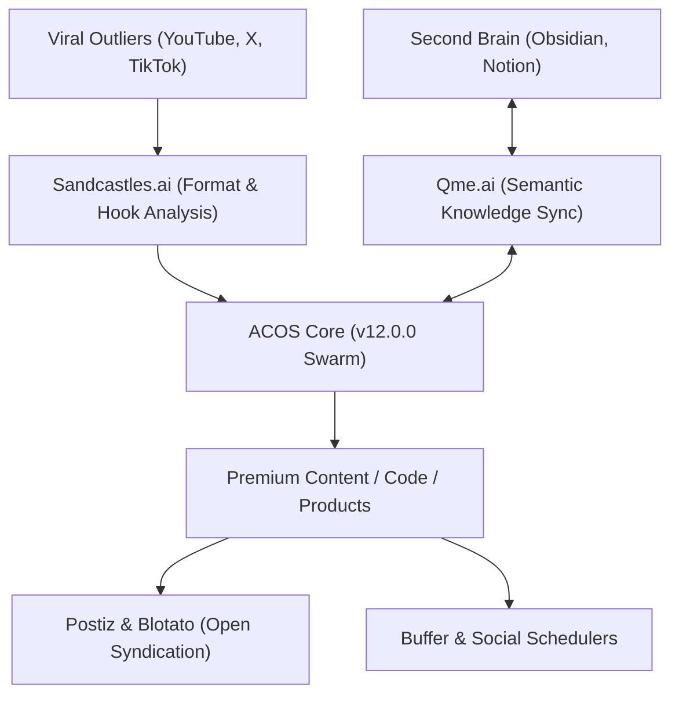

# 🧬 ACOS v12.0.0 — The CAIO Creator-Founder Playbook
*Agentic Creator OS: Universal Substrate for Modern Media & Product Innovation*

As a modern Chief AI Officer (CAIO) and creator-founder, your highest leverage asset is not your production team, but your **Agentic Swarm**. ACOS v12.0.0 turns raw generative models into an aligned organization of specialists, running on top of **Claude Code, Google Antigravity, OpenAI Codex, and xAI Grok**.

This vision handbook maps how large influencers, educators, and developer-founders utilize ACOS to maximize content resonance, automate multi-channel syndication, organize deep research hubs, and invent new digital products.

---

## 1. The Creator-Founder Stack

To capture outliers, synthesize research, and syndicate across the web, ACOS integrates with key modern protocols:

### Key Connectors
1. **Sandcastles.ai (Viral Outlier Discovery)**: Identifies video formats, hooks, and narrative curves that perform 10x above a channel's baseline. ACOS parses these structures to generate custom scripts that preserve the viral geometry while aligning with your brand.
2. **Qme.ai (Knowledge Graph & Second Brain)**: Synthesizes handwritten notes, transcripts, and web captures. It acts as the search boundary, allowing your agentic team to run queries against your personal knowledge base (Obsidian/Notion vaults).
3. **Postiz & Blotato (Decentralized Distribution)**: Orchestrates syndication. Instead of manual copy-pasting, ACOS cascades a single long-form asset into X threads, LinkedIn posts, newsletter segments, and YouTube shorts scripts, formatting them and pushing them directly to Postiz/Buffer APIs.

---

## 2. Standard Workflows (v12.0.0 Specs)

### A. The Content Cascade (`/viral-cascade`)
1. **Outlier Intake**: `Sandcastles-connector` scans targeted channels and returns the structural markdown of a viral outlier.
2. **Brain Contextualization**: `Qme-second-brain` retrieves relevant facts, personal stories, or code snippets from your Obsidian vault matching the topic.
3. **Writing Swarm**: `brand-voice` and `content-polisher` co-author a long-form article and video script.
4. **Distribution Packaging**: `postiz-distributor` breaks the content down into platform-native formats and queues it for release.

### B. The Second Brain Research Hub (`/research-sync`)
Builds a public or private research portal (similar to `frankx.ai/research`) directly from your local Obsidian notes:
1. **Scan**: Read new entries in selected vault folders.
2. **Synthesize**: Group entries, link citations, and validate marketing claims.
3. **Publish**: Compile static Next.js pages, generate search indexes, and output RSS feeds.

---

## 3. Product & Service Innovation
Modern creator-founders do not just sell attention—they sell **packaged utility**. Your ACOS swarm can be used to brainstorm, prototype, and ship new services:
- **UI/UX Kits**: Package your frontend components into reusable templates (`Product-engine` style).
- **Custom Agent Packets**: Bundle specialized ACOS subagents (e.g. `medical-analyst`, `tax-advisor-nl`) and sell them to your community.
- **MCP Servers**: Package local database interfaces or API connectors as model-context-protocol plugins.

---

*ACOS v12.0.0 — Built for Sovereignty, Scale, and Creator Autonomy.*
